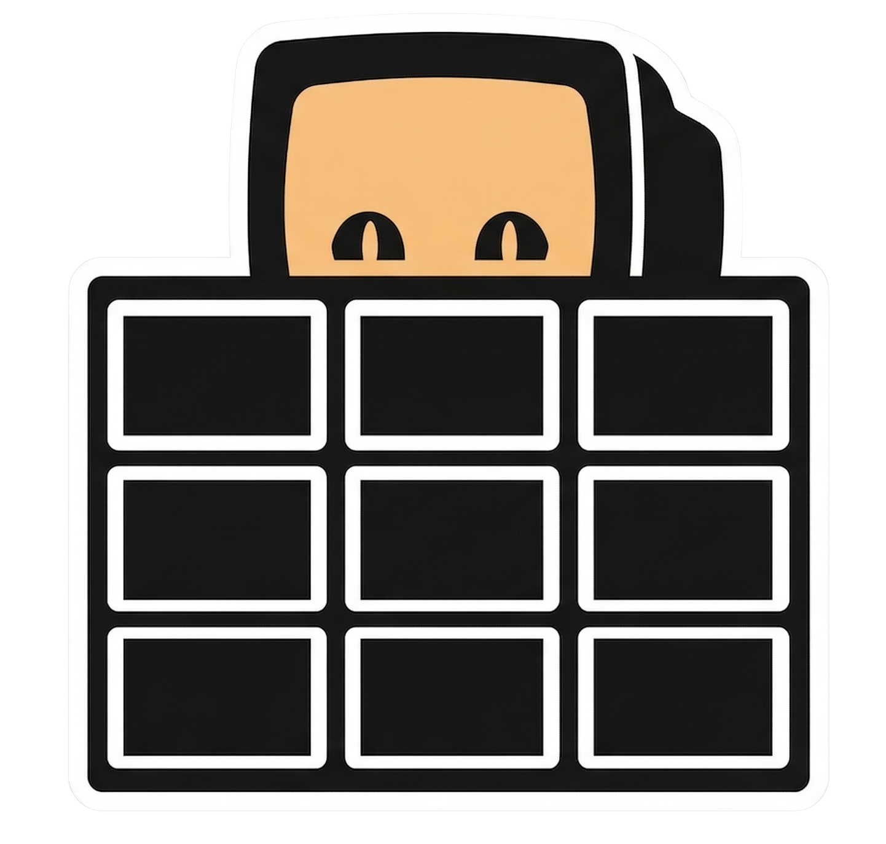

<div align="center">



# Trecli

**A Beautiful, Terminal-based TUI Client for Trello.**

[](https://golang.org)
[](https://opensource.org/licenses/MIT)

*Trecli* brings your Trello boards straight into your CLI. Built entirely in Golang with the powerful [Bubble Tea](https://github.com/charmbracelet/bubbletea) framework, it offers a fast, elegant, and highly interactive Kanban experience without ever having to touch a mouse or open a browser.

</div>

---

## Features

- **Instant Board Access**: Load your workspaces and boards interactively.
- **Side-by-Side Kanban**: Experience a true Trello board natively rendered side-by-side in your terminal, complete with auto-sizing and horizontal scrolling.
- **Keyboard Driven Navigation**: Vim-like mapping & Arrow-key support to move effortlessly across columns and cards.
- **Remote Card Management**: Dive into detailed views, edit titles and descriptions, move cards between lists, or archive them seamlessly—all from your keyboard.
- **Full Label Support**: Visualize card labels directly on the Kanban board and in detailed views with colored badges. Integrated label picker in edit mode lets you toggle labels efficiently.
- **Rich Markdown Rendering**: Descriptions are visually parsed and rendered perfectly with `glamour`, supporting syntax highlighting, word wrap, and dark mode optimizations dynamically matching your terminal width.
- **Smart Attachment Downloads**: Press a single key to download all card attachments natively into your working directory with automatic collision-safe renaming.
- **Browser Integration**: Keep your flow going by jumping directly from the CLI to the card's native URL via your OS default browser.
- **Fluid Non-Blocking UX**: API calls (like saving edits or archiving) are safely executed in the background, overlaid with beautiful, centered spinner popups so the main UI never freezes.
- **Secure Local Auth**: Retains your Trello credentials safely via a lightweight, CGO-free local SQLite database (`modernc.org/sqlite`).
- **Premium TUI Polish**: Dynamic list borders, spinner loaders, and contextual help footers using Charm's `lipgloss` and `bubbles`.

---

## Installation

Ensure you have **Go 1.20+** installed on your system.

```bash
# Clone the repository
git clone https://github.com/davidmahbubi/trecli.git

# Go into the project directory
cd trecli

# Build the executable
go build -o trecli ./cmd/trecli/main.go

# Start managing your tasks
./trecli
```

*(Alternatively, you can just run `go run ./cmd/trecli/main.go` for immediate execution).*

---

## Authentication
The first time you start Trecli, you will be prompted to authenticate:
1. Open your browser to generate a **Trello API Key** and a **Server Token**.
2. Paste them into Trecli's secure prompt.
3. Your login is persistently cached in `~/.config/trecli/trecli.db`. 

To reset or logout, simply delete the SQLite DB file.

---

## Shortcuts & Keybindings

Trecli is meant to be highly efficient. The bottom footer dynamically changes to assist you. 

### Kanban View
| Key Binding      | Action                 |
|------------------|------------------------|
| `← / h`          | Focus Left List        |
| `→ / l`          | Focus Right List       |
| `↑ / k`          | Move up in List        |
| `↓ / j`          | Move down in List      |
| `Enter`          | Open Card Details      |
| `q / Esc`        | Return to Boards       |
| `/`              | Filter/Search Cards    |

### Card Detail View
| Key Binding      | Action                 |
|------------------|------------------------|
| `e`              | Edit Card              |
| `m`              | Move Card to a New List|
| `a`              | Archive Card           |
| `d`              | Download Attachments   |
| `o`              | Open in Browser        |
| `q / Esc`        | Back to Kanban Board   |

### Card Edit Mode
| Key Binding      | Action                 |
|------------------|------------------------|
| `Tab`            | Cycle through fields   |
| `↑ / ↓`          | Navigate Label Picker  |
| `Space`          | Toggle selected Label  |
| `Ctrl+S`         | Save Changes           |
| `Esc`            | Cancel edits           |

---

## Technology Stack

- **[Golang](https://go.dev/)**: Core application logic.
- **[Bubbletea](https://github.com/charmbracelet/bubbletea)**: The Elm Architecture framework for Go TUIs.
- **[Glamour](https://github.com/charmbracelet/glamour)**: Powerful Markdown styling and rendering.
- **[Lipgloss](https://github.com/charmbracelet/lipgloss)**: Terminal styling, colors, and layouts.
- **[Bubbles](https://github.com/charmbracelet/bubbles)**: Core components (Lists, Spinners, TextInputs, Help Menus).
- **[Go-SQLite](https://modernc.org/sqlite)**: CGO-free permanent local credential storage.

---

## Contributing
Contributions, issues, and feature requests are welcome!
Feel free to check the [issues page](https://github.com/davidmahbubi/trecli/issues).

1. Fork the Project
2. Create your Feature Branch (`git checkout -b feature/AmazingFeature`)
3. Commit your Changes (`git commit -m 'Add some AmazingFeature'`)
4. Push to the Branch (`git push origin feature/AmazingFeature`)
5. Open a Pull Request

---

## License
Distributed under the MIT License
